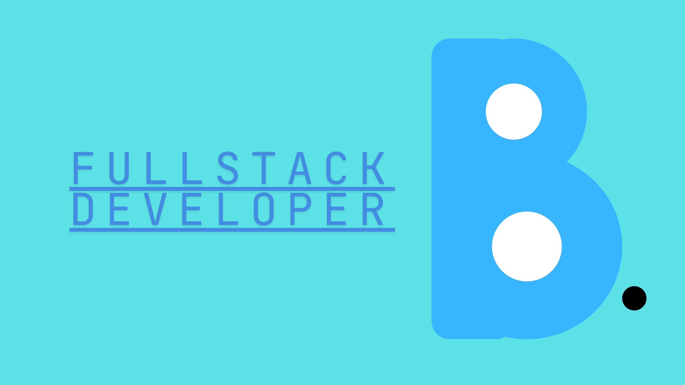

## Hello there, nyu is here👋🐶

<!-- 

- 🌱 I’m currently learning about **fullstack developer**

##### Skills:

##### Connect with me:
](https://img.shields.io/badge/Instagram-E4405F?style=for-the-badge&logo=instagram&logoColor=white)

](https://img.shields.io/badge/LinkedIn-0077B5?style=for-the-badge&logo=linkedin&logoColor=white)

##### My github stats

 -->

## 🌐 Socials:
    

# 💻 Tech Stack:
           
# 📊 GitHub Stats:
 
 

## 🏆 GitHub Trophies

### 🔝 Top Contributed Repo

---

<!-- Proudly created with GPRM ( https://gprm.itsvg.in ) -->
